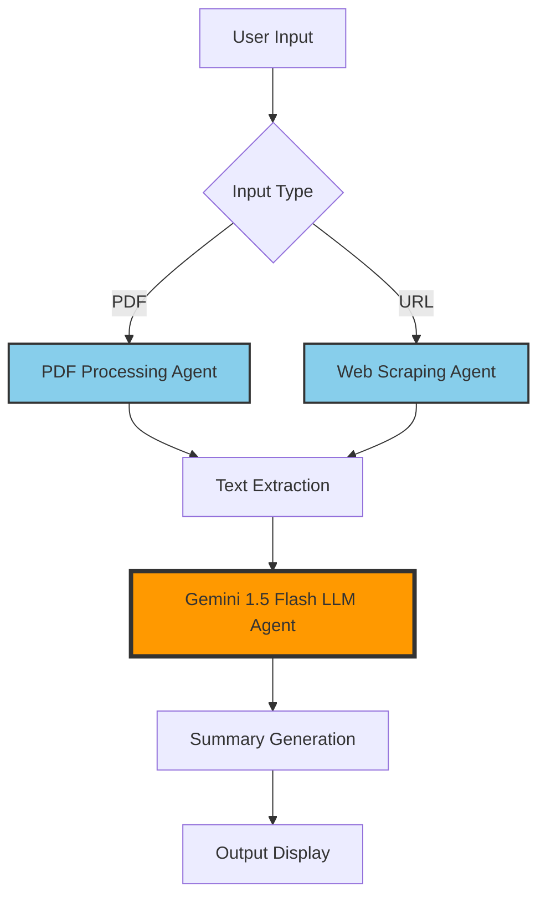
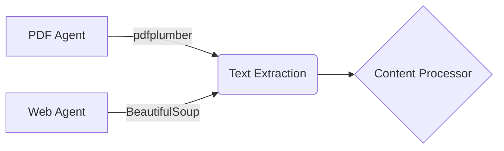
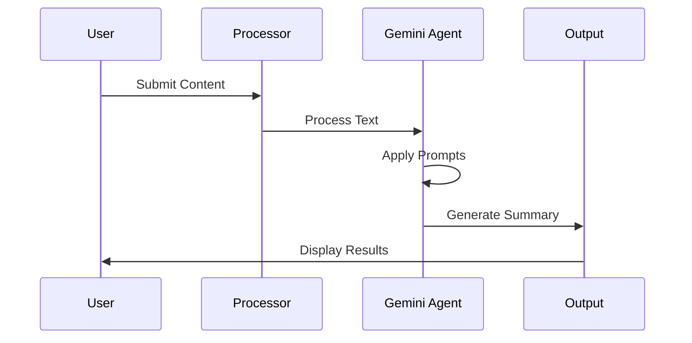
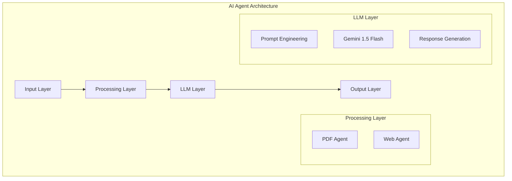

# AI-Agent Implementation

## Agent Architecture Overview



## Features

- Dual Input Processing:
  - PDF Document Analysis
  - Web Content Extraction
- Advanced LLM Integration with Gemini 1.5 Flash
- Real-time Processing
- Streamlit Interface

## Agent Components Architecture

### 1. Input Processing Agents


### 2. LLM Agent Flow


## Implementation Requirements

1. **Environment Setup**
```bash
pip install -r requirements.txt
```

2. **API Configuration**
```bash
# Create .env file
GOOGLE_API_KEY=your_api_key_here
```

3. **Application Launch**
```bash
streamlit run app.py
```

## Technical Architecture

### AI Agent Implementation Details

1. **PDF Processing Agent**
   - Core Component: pdfplumber
   - Functionality: Text extraction from multi-page documents
   - Error Handling: Format validation and extraction verification

2. **Web Scraping Agent**
   - Core Component: BeautifulSoup4
   - Functionality: Targeted content extraction
   - Error Handling: Connection management and timeout control

3. **Gemini LLM Agent**
   - Model: Gemini 1.5 Flash
   - Implementation: Chain-of-thought prompting
   - Processing: Zero-shot summarization
   - Integration: LangChain framework




## Core Dependencies

- streamlit
- pdfplumber
- beautifulsoup4
- langchain
- google-generativeai
- python-dotenv
- requests

## Development

The source code implements three main agent components:
1. Document Processing Agent (PDF and Web)
2. Text Extraction and Processing Agent
3. LLM Integration Agent

For the complete implementation, refer to the `app.py` file in the repository.
